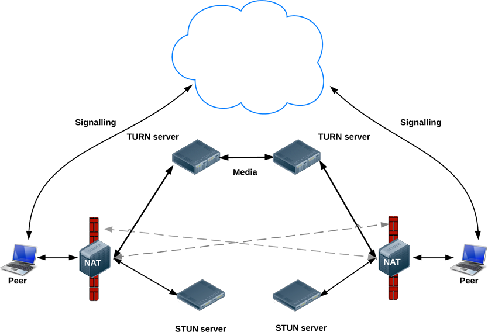

= webrtc

=== 概述

webrtc是W3C定义的一套 http://www.w3.org/TR/webrtc/[API], 通过webrtc可以实现基于浏览器的P2P实时多媒体交互(视频聊天)， 任意的二进制数据传输，无需安装第三方插件。

浏览器厂商需要自己实现这套API，现在支持的浏览器:

* Desktop PC
    ** Google Chrome 23
    ** Mozilla Firefox 22
    ** Opera 18
* Android
    ** Google Chrome 28 (Enabled by default since 29)
    ** Mozilla Firefox 24
    ** Opera Mobile 12
* Chrome OS
* Firefox OS

'''

=== overall architecture

image::WebRTCpublicdiagramforwebsite.png[]
'''

=== 主要的API

* MediaStream
* RTCPeerConnection
* RTCDataChannel

'''

=== Signaling Server

. 作用：发现peer, 交换数据
. 交换的数据
 * Session control messages 
 * Network configuration(ICE candidate)
 * Media info(codes,resolutions)(SDP)

.RTCPeerConnection diagram
image::RTCPeerConnection-diagram.png[]
 
'''

=== Terminology

==== STURN/TURN: discover public address/Relay 

. STUN (Session Traversal Utilities for NAT):  A STUN server allows clients to discover their public IP address,The STUN protocol is defined in https://tools.ietf.org/html/rfc3489[RFC 3489]. 

. TURN (Traversal Using Relays around NAT): is an extension to STUN that allows media traversal over a NAT when p2p direct communication fails. TURN is specified by https://tools.ietf.org/html/rfc5766[RFC 5766].

 http://www.html5rocks.com/en/tutorials/webrtc/infrastructure/

 RTCPeerConnection tries to set up direct communication between peers over UDP. If that fails, RTCPeerConnection resorts to TCP. If that fails, TURN servers can be used as a fallback, relaying data between endpoints.
 Just to reiterate: TURN is used to relay audio/video/data streaming between peers, not signaling data!
 TURN servers have public addresses, so they can be contacted by peers even if the peers are behind firewalls or proxies. TURN servers have a conceptually simple task — to relay a stream — but, unlike STUN servers, they inherently consume a lot of bandwidth. In other words, TURN servers need to be beefier.

.Using STUN servers to get public IP:port addresses
image::stun.png[]

.The full Monty: STUN, TURN and signaling

'''

==== ICE/ICE Agent/SDP/SDP Agent

. Interactive Connectivity Establishment (ICE): A Protocol for Network Address Translator (NAT) Traversal for Offer/Answer Protocols

. https://tools.ietf.org/html/draft-ietf-rtcweb-overview-14#section-2.4[ICE Agent] :  An implementation of the Interactive Connectivty Establishment (ICE) https://tools.ietf.org/html/rfc5245#section-4[RFC5245] protocol.  An ICE Agent may also be an SDP Agent, but there exist ICE Agents that do not use SDP (for instance those that use Jingle).

 负责P2P连接的建立，首先尝试直接连接，失败则通过TURN Server relay
 
 
. A CANDIDATE is a transport address -- a combination of IP address and port for a particular transport protocol (with only UDP specified here)

  candidate:2235002845 1 udp 2122194687 192.168.5.84 43492 typ host generation 0

. https://en.wikipedia.org/wiki/Session_Description_Protocol[SDP]

  The Session Description Protocol (SDP) is a format for describing streaming media initialization parameters.
  多媒体会话描述协议。

. SDP Agent:  The protocol implementation involved in the SDP offer/answer exchange, as defined in https://tools.ietf.org/html/rfc3264#section-3[RFC3264].

'''

=== complete diagram
.complete diagram
image::webrtc-complete-diagram.png[]

'''

